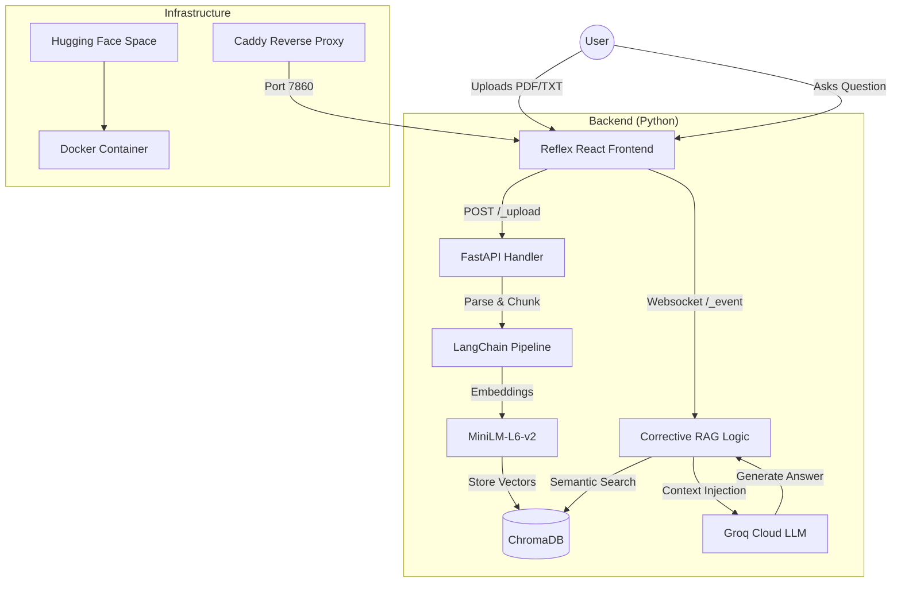

# DocuAi Technical Documentation 📚

DocuAi is an enterprise-grade **RAG (Retrieval-Augmented Generation)** chatbot application designed to turn static documents into interactive knowledge bases. It combines a premium React-based frontend with a powerful vector search engine and Cloud-LLM inference.

---

## 🏗️ System Architecture

---

## 🛠️ Technology Stack

### 🎨 Frontend
- **Reflex:** Pure Python React framework for seamless full-stack state management.
- **Tailwind CSS:** Modern glassmorphism UI design.

### 🧠 AI Backend
- **LangChain:** Orchestrates document splitting and retrieval logic.
- **ChromaDB:** In-memory vector search database for document context.
- **HuggingFace MiniLM:** Local CPU-efficient embedding model.
- **Groq Llama 3.1:** High-speed cloud LLM for answer synthesis.

### 🚀 Infrastructure
- **Hugging Face Spaces:** 16GB free-tier hosting for high-performance ML workloads.
- **Docker:** Containerized for portability.
- **Caddy:** Reverse proxy for single-port WebSocket routing (7860).

---

## 🔒 Security & Deployment
- **CORS Restricted:** Backend only accepts traffic from authorized Hugging Face domains.
- **Environment Driven:** Keys are handled via secure environment secrets.
- **Rootless Container:** Runs as User 1000 for standard Linux security compliance.

---
**Live Application:** [DocuAi on Hugging Face](https://huggingface.co/spaces/Sikee18/DocuAi)
